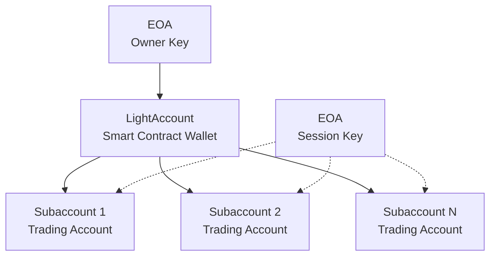

# Understanding Derive's Account Model

Before diving into authentication and trading, it's crucial to understand how accounts work on Derive. This will explain why you need multiple addresses and keys, and why the bridging works the way it does.

## The Problem with Traditional Exchanges

Centralized exchanges hold custody of your funds:

- ❌ You do not control your keys or coins
- ❌ Accounts can be frozen
- ❌ Exchange hacks can lead to loss of funds

Derive avoids these risks by being **self-custodial**: you always control your assets.

## Derive's Smart Contract Wallet Model

A Derive account is a **LightAccount** ([ERC-4337](https://docs.erc4337.io/)), a smart contract wallet you own through your Ethereum address (EOA).

### Your EOA (Externally Owned Account)

This is your regular Ethereum address controlled by your private key:

- Your normal Ethereum wallet address
- Controlled by your private key
- Used to sign transactions, prove ownership, and pay gas fees

### Your LightAccount (Smart Contract Wallet)

This is a smart contract deployed on Derive chain that you own:

- A programmable wallet deployed on Derive
- Owned by your EOA
- Holds funds, manages subaccounts, enables trading
- Can delegate permissions to other addresses
- Transactions are gas-sponsored by Derive

### Subaccounts

- Isolated trading accounts within a LightAccount
- Useful for separating strategies, risks, or teams
- Identified by numeric IDs (e.g., `123456`)

## The Three-Layer Structure

### Layer 1: Your EOA (Owner)

- **Purpose**: Ultimate ownership and control
- **Controlled by**: Your main private key
- **Powers**: Can do everything - bridge funds, withdraw funds, create session keys

### Layer 2: LightAccount (Funding Wallet)

- **Purpose**: Hold your trading capital on Derive
- **Controlled by**: Your EOA (you're the owner)
- **Powers**: Holds funds, manages subaccounts, enables trading
- **Gas**: Transactions are sponsored by Derive's paymaster

### Layer 3: Subaccounts (Trading Accounts)

- **Purpose**: Isolated trading environments
- **Why multiple?**: Different strategies, risk management, organization
- **Example**: Subaccount 1 for spot trading, Subaccount 2 for options

## Session Keys: Secure Delegation

For active trading you should not use your owner key. Instead, delegate to **session keys**:

- Normal EOAs granted limited permissions
- Registered with expiration
- Revocable at any time

### Permission Levels

| Permission    | What it allows                         |
| ------------- | -------------------------------------- |
| **Admin**     | Everything except bridging             |
| **Account**   | Trading, transfers between subaccounts |
| **Read Only** | Query and view data only               |

## Summary

| Component        | Address      | Purpose                    | Pays Gas      | Can Bridge |
| ---------------- | ------------ | -------------------------- | ------------- | ---------- |
| **Your EOA**     | `0x742d...`  | Owner, ultimate control    | 💰 EOA (self) | ✅ Yes     |
| **LightAccount** | `0x8f5B...`  | Holds trading capital      | 🪙 Paymaster  | ❌ No      |
| **Subaccount**   | ID: `123456` | Individual trading account | 🪙 Paymaster  | ❌ No      |
| **Session Key**  | `0x9A8B...`  | Delegated trading access   | 🪙 Paymaster  | ❌ No      |

---

Next: **[Authentication](authentication.md)** - Set up your EOA, LightAccount, and Session Keys.
