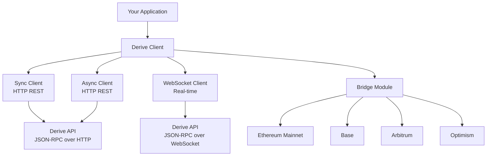

# Derive Client

The **Derive Client** is a comprehensive Python library for interacting with [Derive Protocol](https://derive.xyz) - a decentralized, self-custodial derivatives trading platform on its own Ethereum L2 chain.

## What is Derive?

Derive is a high-performance crypto trading platform offering options, perpetuals, and spot trading. The platform consists of:

- **Derive L2**: A dedicated Layer 2 blockchain built on the OP Stack, secured by Ethereum
- **Trading Engine**: High-performance matching engine for derivatives trading
- **Session Keys**: Secure delegation of trading permissions without compromising wallet security
- **Self-Custodial**: Users maintain full control of their funds through smart contract wallets
- **Multi-Chain Bridging**: Seamless asset bridging from Ethereum, Base, Arbitrum, and Optimism

## Key Features

### **Multiple Client Types**

- **Sync Client**: HTTP-based REST API client for simple, blocking operations
- **Async Client**: Asynchronous HTTP REST API client for high-performance applications
- **WebSocket Client**: Real-time client for streaming data and low-latency trading

### **Built-in Bridging**

- **Multi-Chain Support**: Bridge assets to/from Ethereum, Base, Arbitrum, and Optimism
- **Socket Superbridge**: ERC20 token bridging (WBTC, WETH, USDC, OLAS, etc.)
- **LayerZero**: DRV token bridging across chains

### **Unified API**

All clients support the same core methods through Derive's JSON-RPC protocol, which works over both HTTP and WebSocket transports.

## Architecture Overview

## Getting Started

### 🚀 Start Here

New to Derive? Follow this path:

1. **[Quickstart](quickstart.md)** - Install the client and dependencies
2. **[Examples](examples.md)** - Run working code examples to learn by doing
3. **Background Reading** - Dive deeper when you need it:
   - [Account Model](concepts/account-model.md) - LightAccounts, subaccounts, and session keys
   - [Authentication](concepts/authentication.md) - Registering accounts and session keys
   - [Bridging](concepts/bridging.md) - Deposit and withdraw assets
   - [Clients](concepts/clients.md) - Choose the right client for your use case

### 📚 Reference

- **[Official Documentation](https://docs.derive.xyz/)**
- **[API Reference](reference/SUMMARY.md)** - Method documentation of the public API
- **[Internal API](internal/SUMMARY.md)** - Complete reference for contributors

## Community & Support

- **GitHub**: [8ball030/derive_client](https://github.com/8ball030/derive_client)
- **Issues**: Report bugs or request features
- **Derive Platform**: [derive.xyz](https://derive.xyz)

---

_Ready to start trading derivatives on Derive? Jump to [Quickstart](quickstart.md) →_
