# Derive Client

The **Derive Client** is a comprehensive library for interacting with [Derive Protocol](https://derive.xyz) - a decentralized, self-custodial derivatives trading platform built on Ethereum.

## What is Derive?

Derive is a high-performance crypto trading platform offering options, perpetuals, and spot trading. The platform consists of:

- **Derive Chain**: An Optimistic rollup settlement layer built on the OP Stack, secured by Ethereum
- **Trading Engine**: High-performance matching engine for derivatives trading
- **Self-Custodial**: Users maintain full control of their funds through smart contract wallets

## Key Features

### **Multiple Client Types**

- **Sync Client**: HTTP-based REST API client for simple, blocking operations
- **Async Client**: Asynchronous HTTP REST API client for high-performance applications
- **WebSocket Client**: Real-time client for streaming data and low-latency trading

### **Built-in Bridging**

- **Standard Bridge**: ETH bridging from Ethereum mainnet to Derive for gas fees
- **Derive Bridge**: Asset bridging using Socket Superbridge (WBTC, WETH, USDC, etc.) and LayerZero (DRV token)
- **Session Keys**: Secure delegation of trading permissions without compromising wallet security

### **Unified API**

All clients support the same core methods through Derive's JSON-RPC protocol, which works over both HTTP and WebSocket transports.

## Architecture Overview

```mermaid
graph TB
    A[Your Application] --> B[Derive Client]
    B --> C[Sync Client<br/>HTTP REST]
    B --> D[Async Client<br/>HTTP REST]
    B --> E[WebSocket Client<br/>Real-time]
    B --> F[Bridge Module]

    C --> G[Derive API<br/>JSON-RPC over HTTP]
    D --> G
    E --> H[Derive API<br/>JSON-RPC over WebSocket]

    F --> I[Standard Bridge<br/>ETH Mainnet → Derive]
    F --> J[Socket Superbridge<br/>ERC20 Tokens]
    F --> K[LayerZero<br/>DRV Token]
```

## Next Steps

### Getting Started

1. **[Installation](getting-started/installation.md)** - Install the client and dependencies
2. **[Account Model](getting-started/account-model.md)** - Understand EOA, LightAccount, subaccounts, and session keys
3. **[Authentication](getting-started/authentication.md)** - Register accounts and session keys via the web app
4. **[Bridging & Funding](getting-started/bridging.md)** - Deposit and withdraw assets to/from Derive
5. **[Clients](getting-started/clients.md)** - Choose the right client for your use case
6. **[Quick Start](getting-started/quickstart.md)** - Connect, fund, and start using the client programmatically

### Need Help?

- **[Examples](examples/)** - Working code examples
- **[API Reference](reference/)** - Complete method documentation

---

_Ready to start trading derivatives on Derive? Let's get you set up!_
